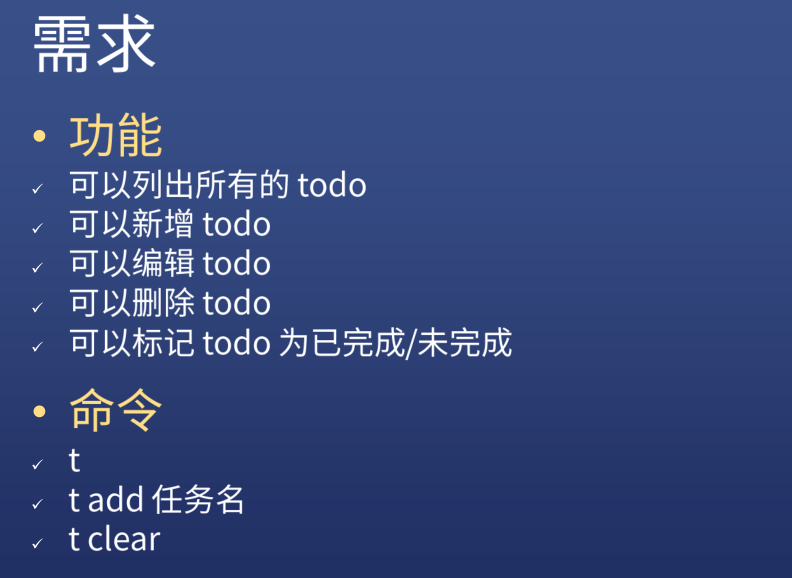

### ✍️ Tangxt ⏳ 2022-01-02 🏷️ Node.js 

# 02-文件模块

1）本课目标

完成一个基于「文件」的 todo 工具

💡：完成后的效果是怎样的？

``` bash
yarn global add node-todo-1
```

💡：这个工具有哪些功能，以及我们通过什么命令可以使用这些功能？



💡：如何学习？


> CRM -> 去官网或网上抄一些代码，抄完后让这些代码能够成功的运行，修改这个代码，在修改的过程中，你大概就能理解这个代码的原理是啥了 -> 继续运行，继续修改 -> 这个功能完成后，再去抄新的代码
> 
> 修改的目的是为了完成某个功能
> 
> 总之，不停地 CRM

💡：完成这个工具需要用到的依赖？

``` json
{
  "name": "node-todo-2",
  "version": "0.0.3",
  "main": "index.js",
  "license": "MIT",
  "bin": {
    "t": "cli.js"
  },
  "files": [
    "*.js"
  ],
  "scripts":{
    "test": "jest"
  },
  "dependencies": {
    "commander": "^3.0.2",
    "inquirer": "^7.0.0"
  },
  "devDependencies": {
    "jest": "^24.9.0"
  }
}
```

2）创建 Node.js 命令行项目

