### ✍️ Tangxt ⏳ 2022-01-02 🏷️ Node.js 

# 02-文件模块

### <mark>1）本课目标</mark>

完成一个基于「文件」的 todo 工具

💡：完成后的效果是怎样的？

``` bash
yarn global add node-todo-1
```

💡：这个工具有哪些功能，以及我们通过什么命令可以使用这些功能？


💡：如何学习？


> CRM -> 去官网或网上抄一些代码，抄完后让这些代码能够成功的运行，修改这个代码，在修改的过程中，你大概就能理解这个代码的原理是啥了 -> 继续运行，继续修改 -> 这个功能完成后，再去抄新的代码
> 
> 修改的目的是为了完成某个功能
> 
> 总之，不停地 CRM

💡：完成这个工具需要用到的依赖？

``` json
{
  "name": "node-todo-2",
  "version": "0.0.3",
  "main": "index.js",
  "license": "MIT",
  "bin": {
    "t": "cli.js"
  },
  "files": [
    "*.js"
  ],
  "scripts":{
    "test": "jest"
  },
  "dependencies": {
    "commander": "^3.0.2",
    "inquirer": "^7.0.0"
  },
  "devDependencies": {
    "jest": "^24.9.0"
  }
}
```

### <mark>2）创建 Node.js 命令行项目</mark>

> 文档：[commander.js/Readme_zh-CN.md at master · tj/commander.js](https://github.com/tj/commander.js/blob/master/Readme_zh-CN.md)

1. `mkdir node-todo`
2. `cd node-todo`
3. `yarn init -y`
4. 修改`package.json`的版本为`0.0.1`
5. 打开`commander.js`文档（安装后，默认会有一个`-h`选项，用来展示有哪些选项和子命令），用 CRM 大法测试：
   1. 如何使用选项（`option`） -> 可以`-h`，也可以`--help`，也可以`-help`（最好是用`--`）
   2. 如何使用子命令（`command`） -> `<>`是必填项，`[]`是可选项 -> 子命令后边的参数获取 -> 如果你写了`<>`，那么命令后的第一个参数就是该命令能拿到的唯一一个参数，第二个参数就是`command`对象，如果你不写`<>`，那么你可以拿到多个输入的参数

- 如果只有一个命令，即写了很多个自定义`option`
- 如果有多个命令，那么你写的自定义`option`只能为某个命令而服务

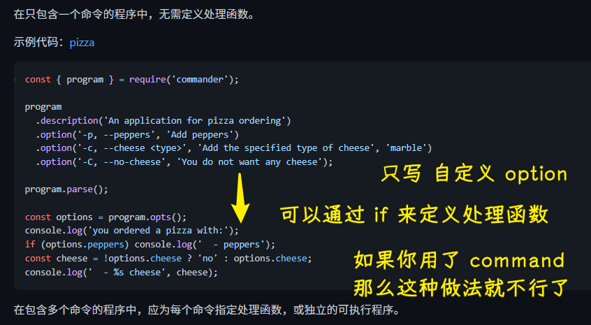

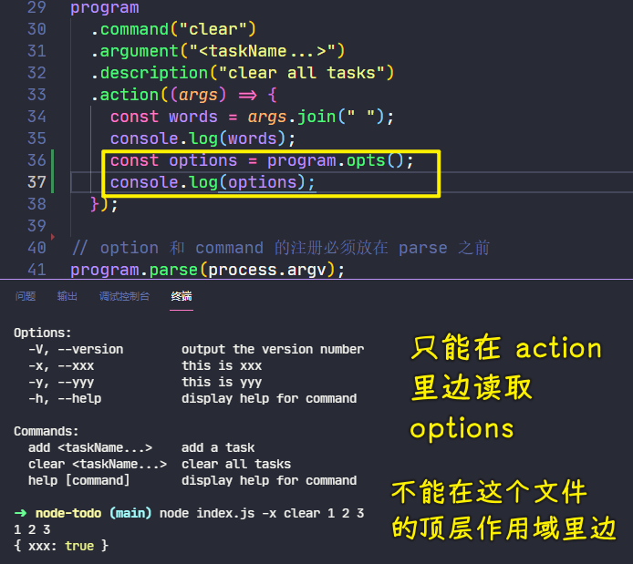

### <mark>3）实现创建功能</mark>

> 查询 API：<https://nodejs.org/dist/latest-v14.x/docs/api/fs.html#fs.readFile()>

- 很简陋的代码，需要在网上抄代码，根据抄到的代码，然后改成自己想要的

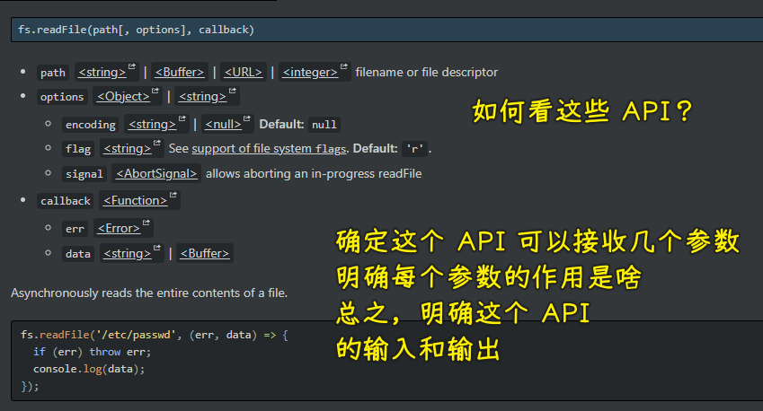

- `'a+'`: Open file for reading and appending. The file is created if it does not exist.

添加任务：

- `node cli.js add 任务 1`

> [Demo](https://github.com/ppambler/fe-diligence-demo/commit/03d20c0)

💡：devdocs 这个网站的配置

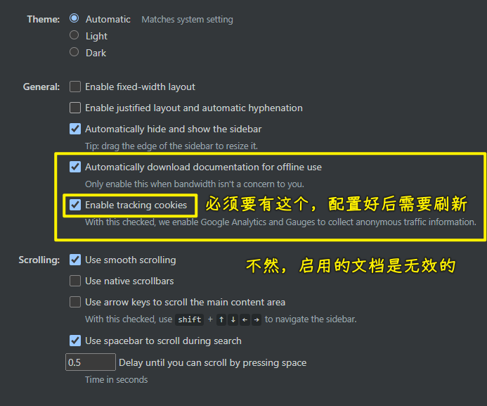

### <mark>4）封装优化代码</mark>

- 面向接口编程

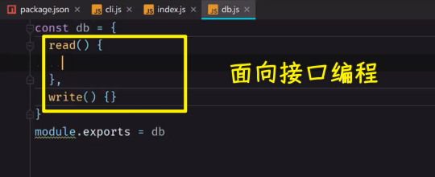

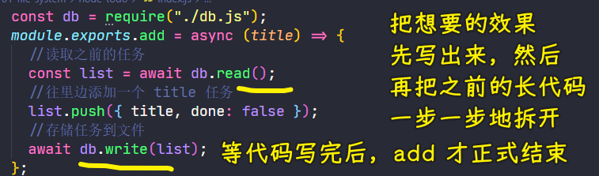

> [Demo](https://github.com/ppambler/fe-diligence-demo/commit/2db3d15)

### <mark>5）消除 WebStorm 的警告</mark>

警告：


消除警告

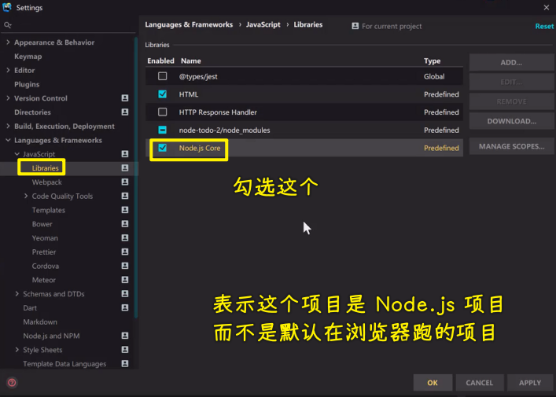

未使用的变量也要删掉：

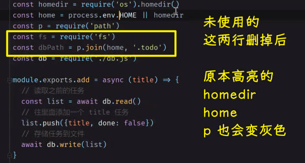

出现错误就得马上改掉，不然，错误积累多了，你就无法发现哪里是真正的错误了！

### <mark>6）完成所有功能</mark>

> 文档：[SBoudrias/Inquirer.js: A collection of common interactive command line user interfaces.](https://github.com/SBoudrias/Inquirer.js/)

清空所有任务`node cli.js clear`：

> [Demo](https://github.com/ppambler/fe-diligence-demo/commit/5cb2fc7)

查看所有任务`node cli.js`：

> [Demo](https://github.com/ppambler/fe-diligence-demo/commit/3bd4b09)

用户既然查看了所有任务，就想着操作一下这些任务：

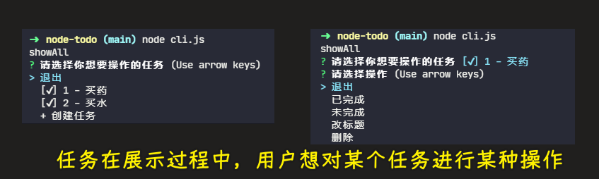

每一个询问操作都会展示成一个列表……


默认操作：

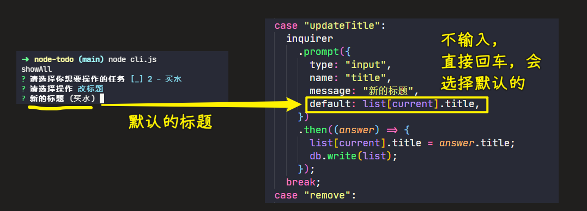

> [Demo](https://github.com/ppambler/fe-diligence-demo/commit/32bb854)

💡：`process.argv`

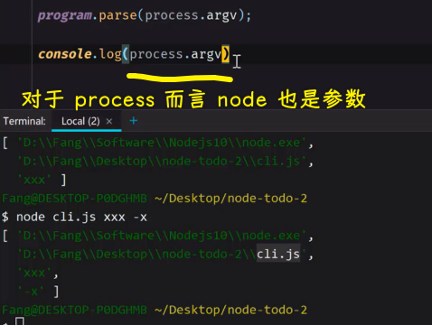

💡：加`then`


> `void` 是 JavaScript 中非常重要的关键字，该操作符指定要计算一个表达式但是不返回值。

当函数返回值是一个不会被使用到的时候，应该使用 `void` 运算符，来确保返回 `undefined`。

➹：[JS 中 void 的正确用法 · 不立不破](https://blog.windrunner.me/fe/void.html)

➹：[谈谈 JS 中的运算符：void 的四大用法 - 简书](https://www.jianshu.com/p/30a582b6a8cd)

💡：`value`用字符串

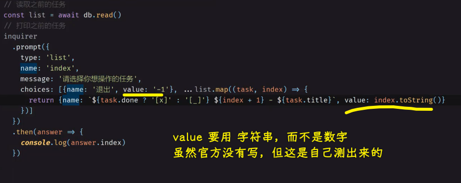

### <mark>7）再次封装优化代码</mark>

面对很长的代码？ -> 不要放到一坨

1. 加注释
2. 给这个函数起一个恰当的名字，然后调用它

注意：优化不是一次就能做好的

> [Demo](https://github.com/ppambler/fe-diligence-demo/commit/f40b154)

💡：webstorm 可以让我们看到代码的结构

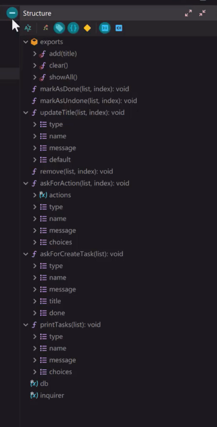

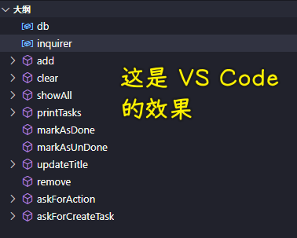

### <mark>8）如何发布到 npm</mark>

> [Demo](https://github.com/ppambler/fe-diligence-demo/commit/db60dd2)

💡：`cli.js` 和 `main.js`的区别

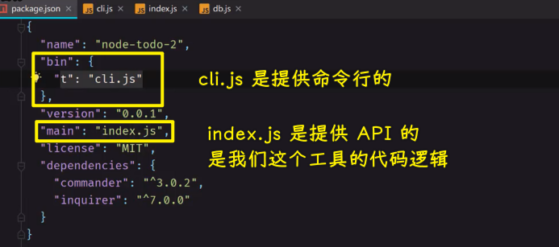

💡：shebang

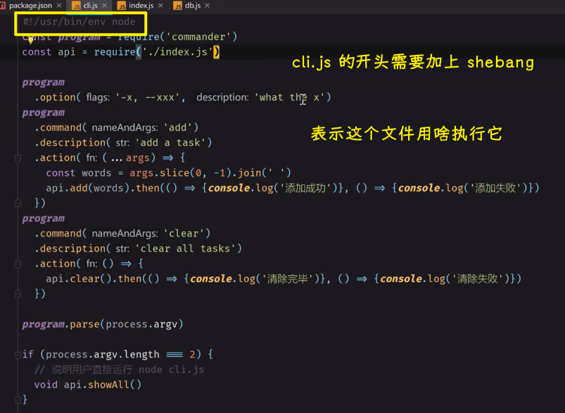

💡：可执行文件

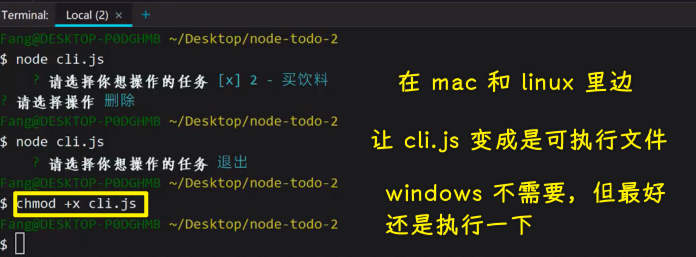

💡：`files`字段

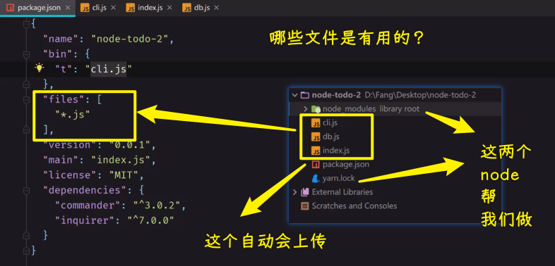

💡：`nrm`

1. `nrm ls`：查看当前用什么源
2. `nrm use npm`：使用 `npm` 的官方源

💡：上传后的处理结果

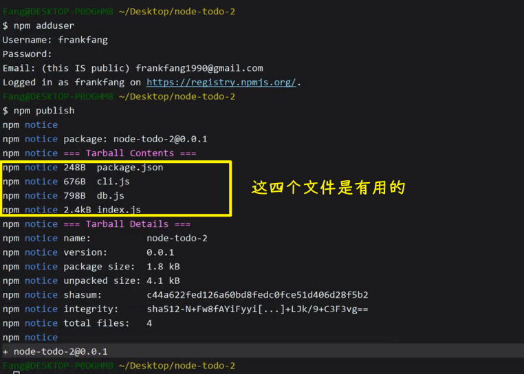

💡：测试

安装刚刚上传的`node-todo-2` -> 不要用淘宝源，因为淘宝源此时还未有同步啊！

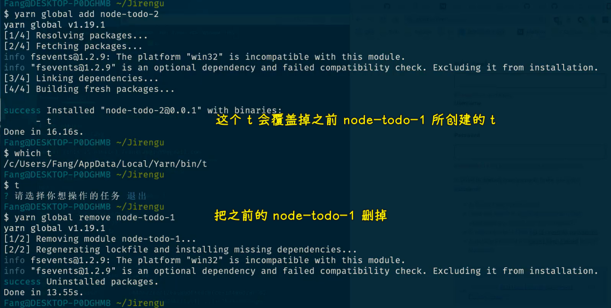

💡：你很讨厌用缩写，可你为啥用`pkg`这个名字，而不是用`package`呢？

因为`package`是保留字啊

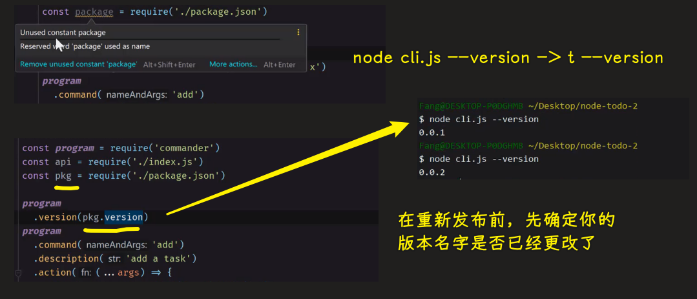

上传后，更新你在本地全局安装的这个包：

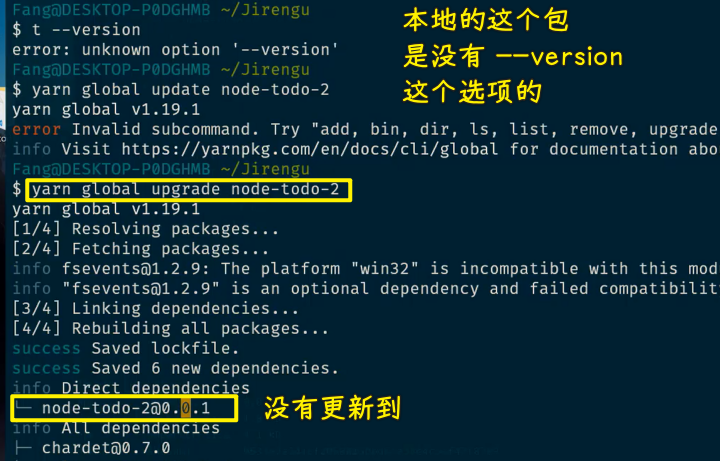

升级不行？

重新安装：

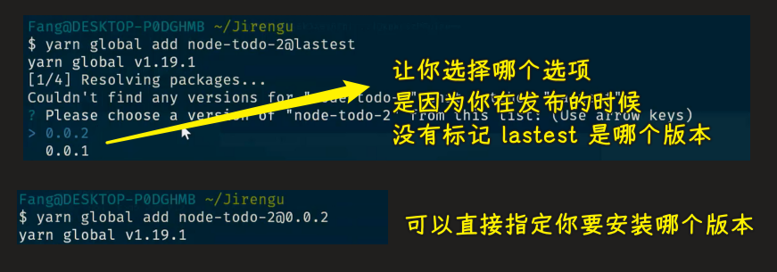

> 可以用`yarn link`来测试，这样你就不用每次更新了版本都重新发布了！等一次性在本地测试完后，再发布版本

💡：总结

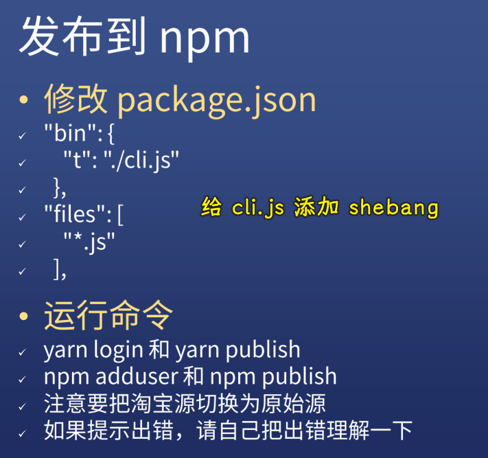


### <mark>9）测试题</mark>

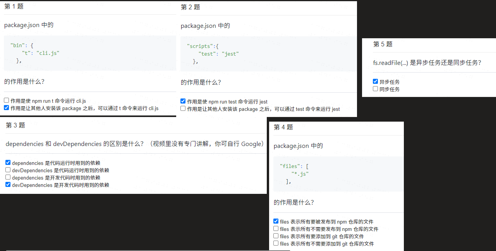
