### ✍️ Tangxt ⏳ 2022-01-06 🏷️ Node.js

# 03-单元测试之文件模块

> 写单元测试是为了帮助了理解代码，一开始你会觉得写单元测试很麻烦，但是写多了，你就会发现它的好处了

### <mark>1）如何测试读文件</mark>

文档：[开始上手 · Jest](https://jestjs.io/zh-Hans/docs/getting-started)

1. 安装开发依赖`jest`
2. 添加测试文件 -> `xxx.test.js`开头
3. 添加`npm scripts`，`jest`在执行的时候会自动找`.test.js`结尾的文件 -> 这是为 VS Code 使用者准备的，Webstorm 不用它也可以在命令行里边直接运行测试用例

💡：用 webstorm 来搞测试？

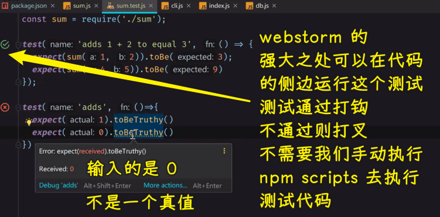

💡：如何让 webstorm 有有关 Jest 这个库的代码提示？

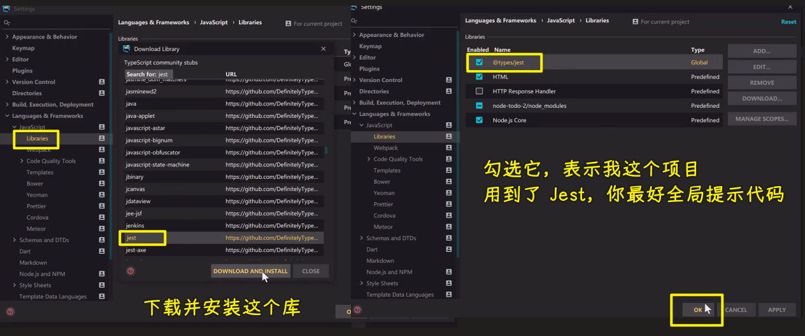

💡：正常的项目不会这样测试

目前的玩具例子：

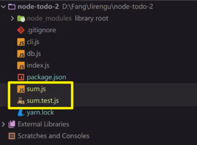

真正的项目测试：

需求：我们要测试读文件和写文件

一些约定：

1. 目录名用`__tests__`
2. 测试文件名不用`xxx.test.js`这个`test`，因为太广泛了，一般用的是`xxx.unit.js`或者`xxx.spec.js` -> 这是不成文的规定 -> 推荐用`spec`这个名字
3. 测试代码不用`test`，而是用`describe`

这是目前最流行的一种写测试的方式：

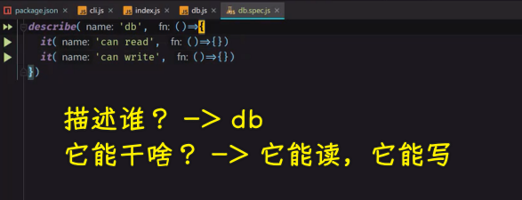

💡：一般单元测试是白盒测试，那啥是白盒测试呢？

白盒测试：我知道代码是怎么写的，测的时候就按照代码写的方式来测

💡：测试读文件

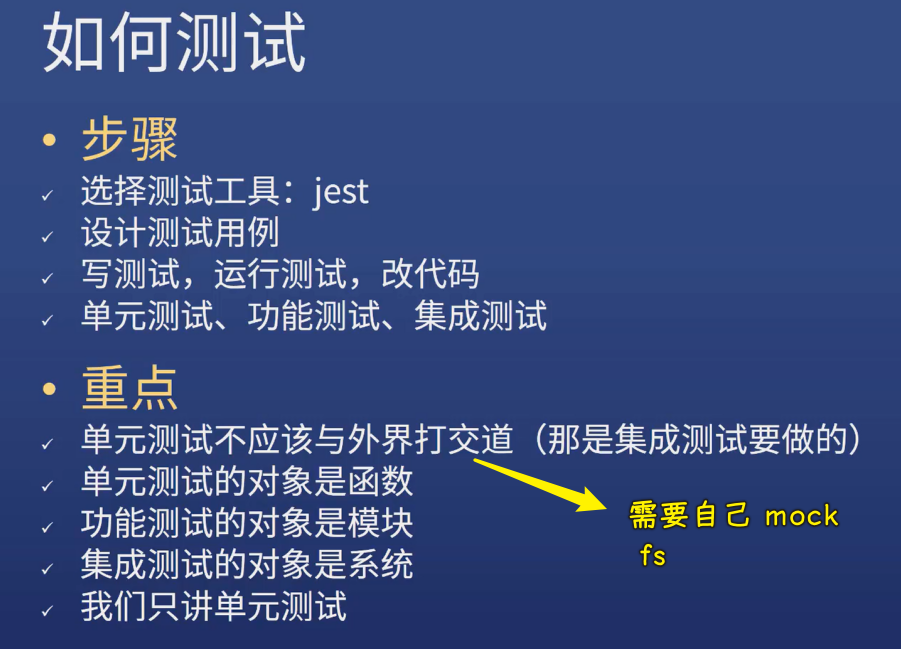

> 功能测试 -> 测试很多个函数 -> 如测试登录功能
> 
> 集成测试 -> 测试一个系统是否可以抵挡住同时有 100 个人访问 -> 这也可以叫性能测试
> 
> 为啥只讲单元测试？ -> 对于前端而言，很多前端开发者都不写单元测试，既然还未学会爬，那就不要学走了，也就是不要学更高级的测试

怎么测试？

1. 我创建一个文件，并给定指定的内容
2. 我用这个`db.read`方法可以读取到这个文件里边的内容

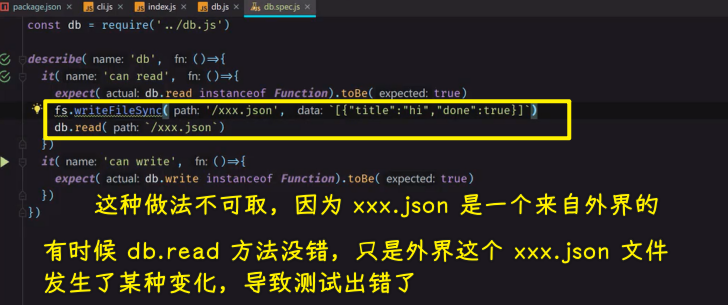

所以，我们需要 mock 一个假文件

> 用了`done`形参，就得调用`done`，这是 jest 的约定

搜索 -> 「jest mock fs」

文档：[Manual Mocks · Jest](https://jestjs.io/docs/manual-mocks)

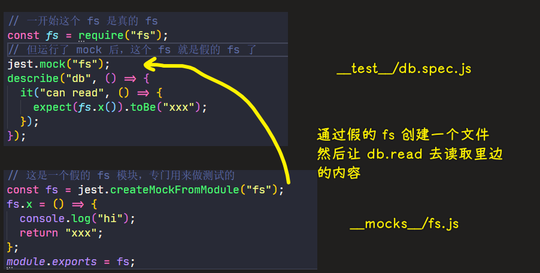

> [Demo](https://github.com/ppambler/fe-diligence-demo/commit/0883559)

这个测试的实质是：测试`db.read`这个方法里边我们传给`readFile`的第三个参数，也就是`callback`，我们没有真正的在硬盘里边创建一个文件，而是直接执行`callback`，因为我们知道这个文件的内容是啥，只要这个`callback`返回的数据跟我们预期的一样即可！

说白了，这是一个假读取，真执行`callback`的过程，这样的好处就是我们不用创建一个真实的文件了！也就是该测试不会影响外界！

💡：`setMock`？

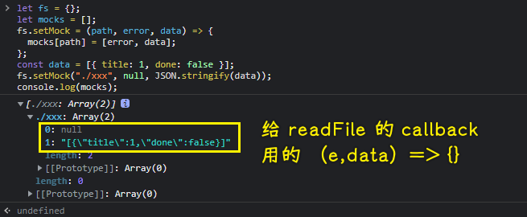

我改成了`const mocks = {}` -> 给`[]`也行，但这结构太难看了

💡：对比两个空数组？

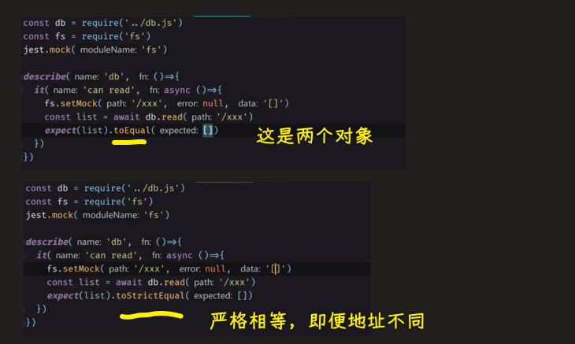

### <mark>2）如何测试写文件</mark>

写这个测试的思路：

不能真正写到某个文件里边，所以我们可以写到一个变量里边

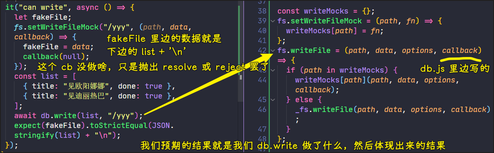

> [Demo](https://github.com/ppambler/fe-diligence-demo/commit/9e96d15)

💡：测试完一个单元就得把它用到的全局变量给重置了，不然这可能会影响到下一个单元的测试

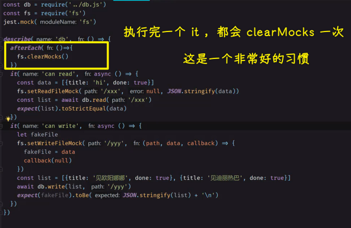

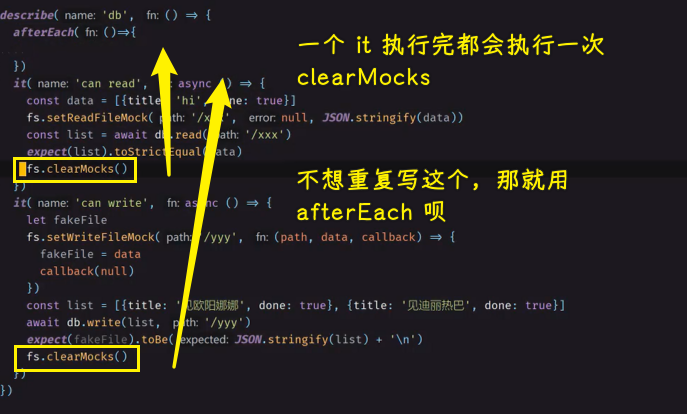

这是一个非常好的习惯，不然，测试代码很有可能互相干扰，既然测试代码都错了，那么这代码也不可能被测好了

总之，测试代码一定是不能写错的

### <mark>3）总结</mark>

- 写这两个单元测试，让我对`readFile`、`writeFile`更熟悉了