### ✍️ Tangxt ⏳ 2022-01-06 🏷️ Node.js 

# 04-调试 Node.js 程序

> 文档：[调试 - 入门指南 - Node.js](https://nodejs.org/zh-cn/docs/guides/debugging-getting-started/)

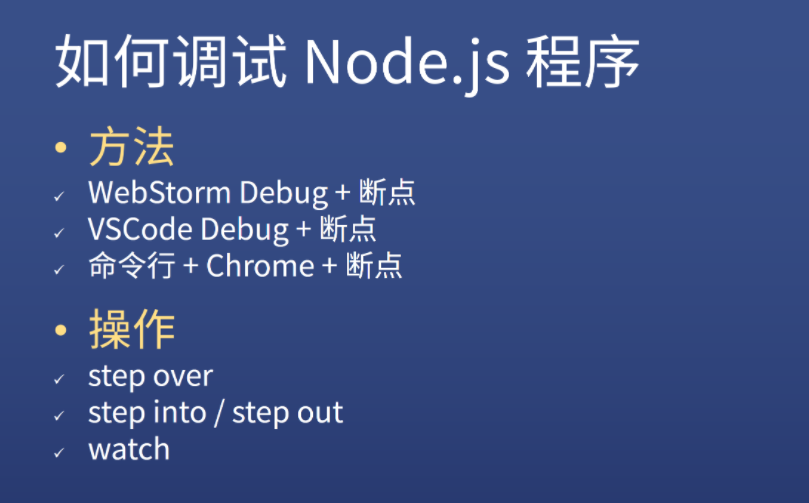

1. Webstorm
2. VS Code
3. Chrome

添加断点的两种姿势：

1. 定位到某行代码，在这行代码的序号左边点一下，会出现一个高亮的小红点
2. 直接在某行写`debugger`

### <mark>1）Webstorm</mark>

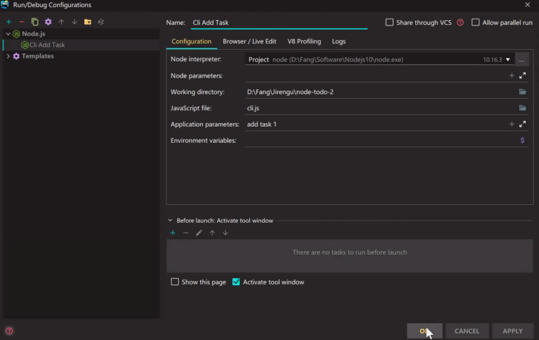

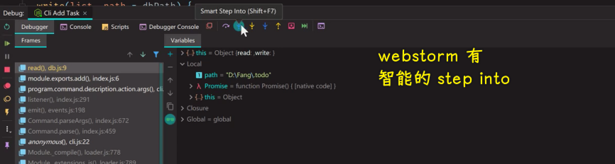

➹：[使用 WebStorm 调试现代前端应用 - 掘金](https://juejin.cn/post/6844903985782980616)

### <mark>2）VS Code</mark>

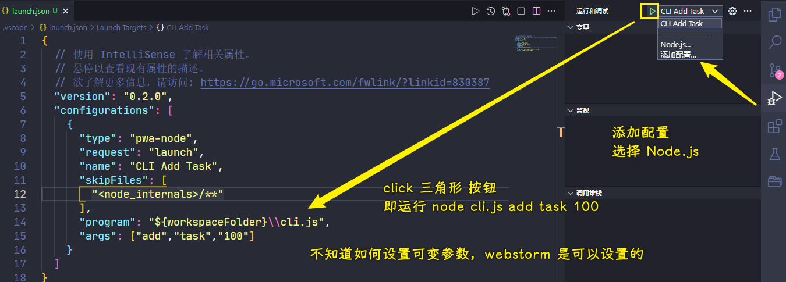

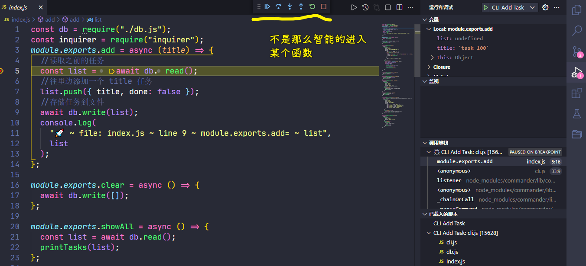

➹：[Debug with VSCode - 知乎](https://zhuanlan.zhihu.com/p/71928374)

➹：[VS Code 调试完全攻略（4）：launch.json 和调试控制台 - SegmentFault 思否](https://segmentfault.com/a/1190000022804681)

➹：[VS Code 调试完全攻略（1）：基础知识](https://mp.weixin.qq.com/s/Xpn5PecikvPD83qJa4SniA)

➹：[Debug anything: The basics](https://charlesagile.com/debug-series-nodejs-browser-javascript)

### <mark>3）Chrome</mark>

`node --inspect` 与 `node --inspect-brk` 的区别：`--inspect` 不会终断（调试 HTTP Server），`--inspect-brk` 在用户代码启动之前会终断，也就是代码在第一行就会暂停执行。

``` bash
node --inspect-brk cli.js add task 200
```

在`index.js`文件里边设置断点：

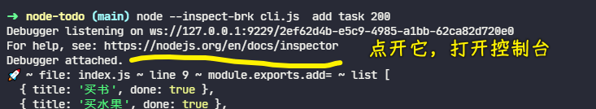

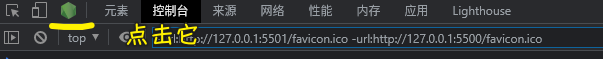

启动程序，回调到断点位置处：

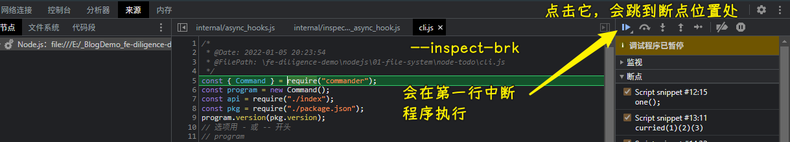

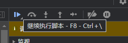

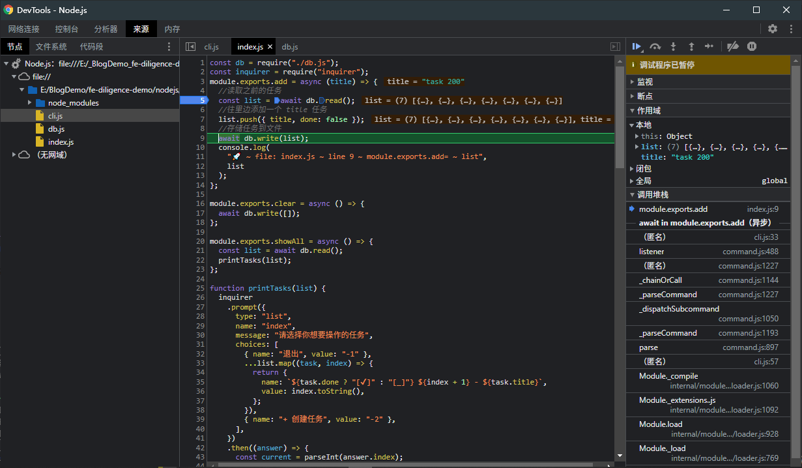

➹：[Node 调试工具入门教程 - 阮一峰的网络日志](http://www.ruanyifeng.com/blog/2018/03/node-debugger.html)

➹：[使用 Chrome Devtools 调试您的 Node.js 程序 - 知乎](https://zhuanlan.zhihu.com/p/338287139)

### <mark>4）测试题</mark>

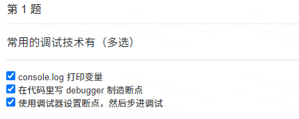