### ✍️ Tangxt ⏳ 2022-01-07 🏷️ Node.js

# 05-静态服务器

这节讲 HTTP 模块，该模块很重要，有了这个模块，你就可以做服务器开发了 -> 该模块需要借助 C/C++ 写的库才得以实现 -> 该 http 模块最终暴露很好用的 API 以供我们使用

理论上应该先学习 HTTP 协议再学习 HTTP 模块 -> 跳过 HTTP 协议的学习，选择在实践中学习这个 HTTP 模块

总之，在不了解 HTTP 协议和 TS 情况下，去实践，实践完后，再去看文档

1）配置 Webstorm 和 VS Code

💡：一些有用的工具

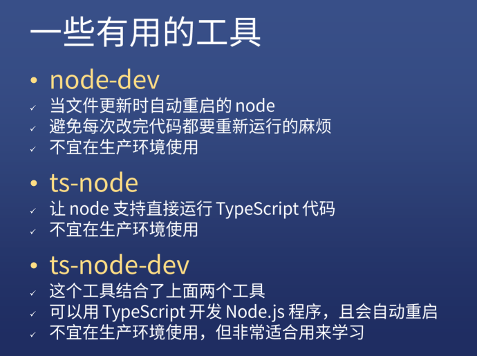

- node-dev -> 不适合在公司使用，因为每次部署重新重启即可，而不是改一下代码就重启一下
- ts-node -> 不需要我们安装 babel 就能支持 ts 在 node 中使用
- ts-node-dev -> 二者的结合体

``` bash
yarn global add ts-node-dev
# or
npm i -g ts-node-dev
```


使用它的时候还得安装`TypeScript`：

``` bash
npm i typescript -g
```

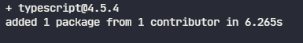

💡：一些有用的工具 2

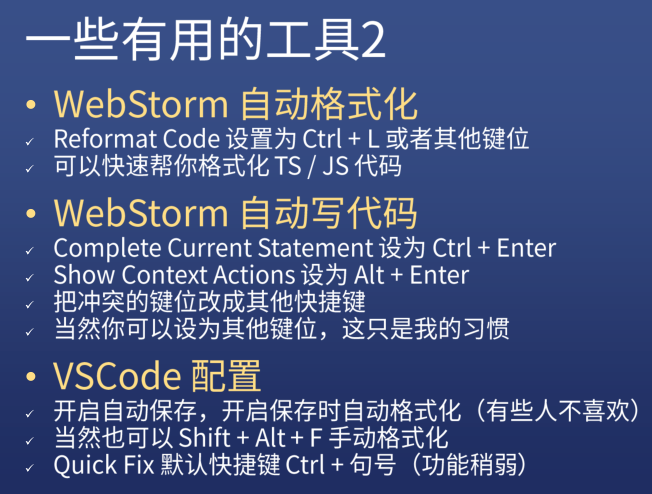

💡：一些有用的工具 3


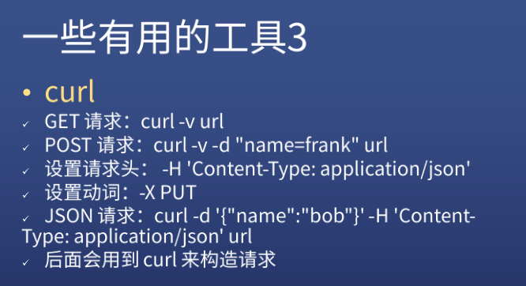

2）创建项目

> 在 VS Code 里边写 TS 项目：[TypeScript Programming with Visual Studio Code](https://code.visualstudio.com/docs/languages/typescript)

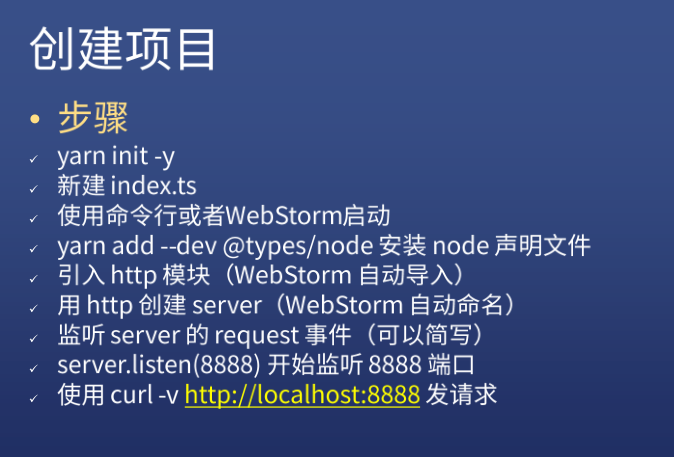

💡：安装`@types/node`，让开发工具知道 node 里边有哪些模块 -> 为了代码的智能提示

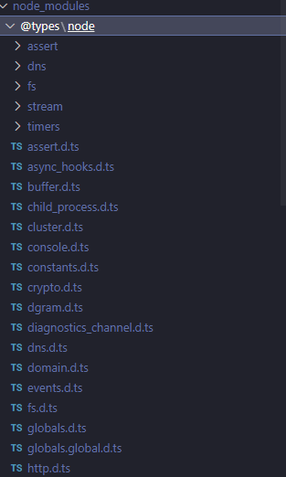

💡：为什么要添加`response.end`？

不添加：

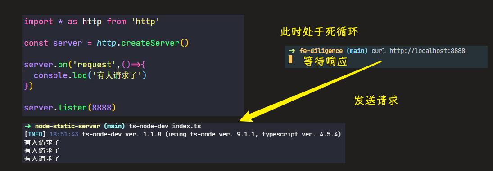

添加后：

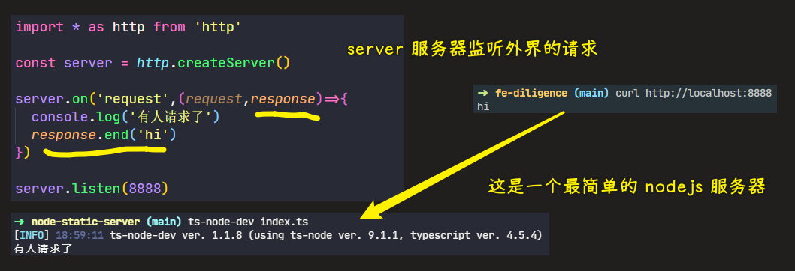

> [Demo](https://github.com/ppambler/fe-diligence-demo/commit/5bd92c6)

3）request 对象

对刚才写的代码进行一个详细和完整的研究

1、Server 是个什么东西？

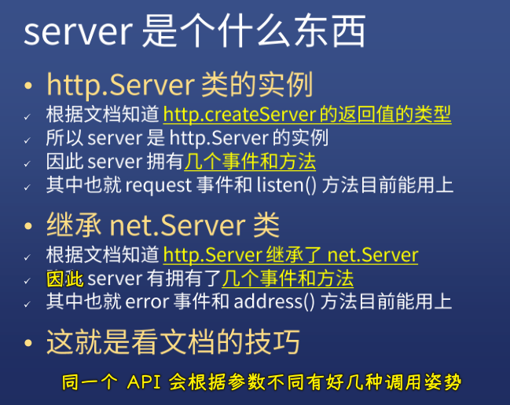

💡：为啥推荐看官方文档？

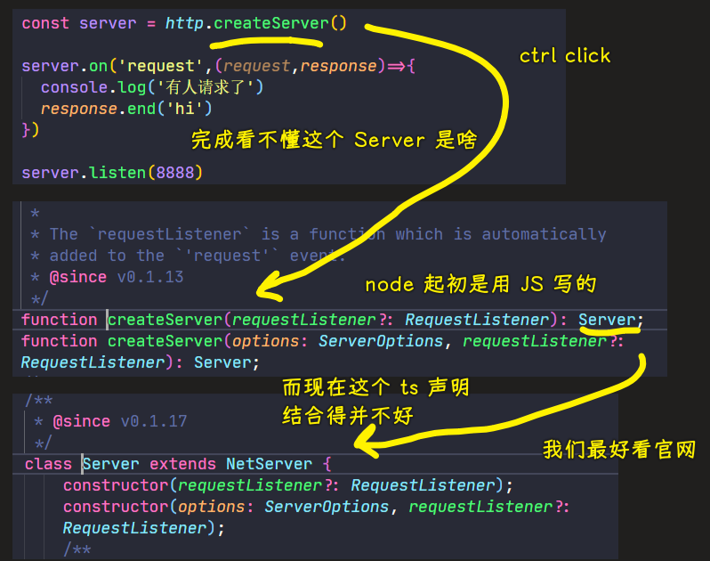

一些开发者为 node 创建的 ts 声明，完全看不懂啊！跟 node 结合的不咋地！

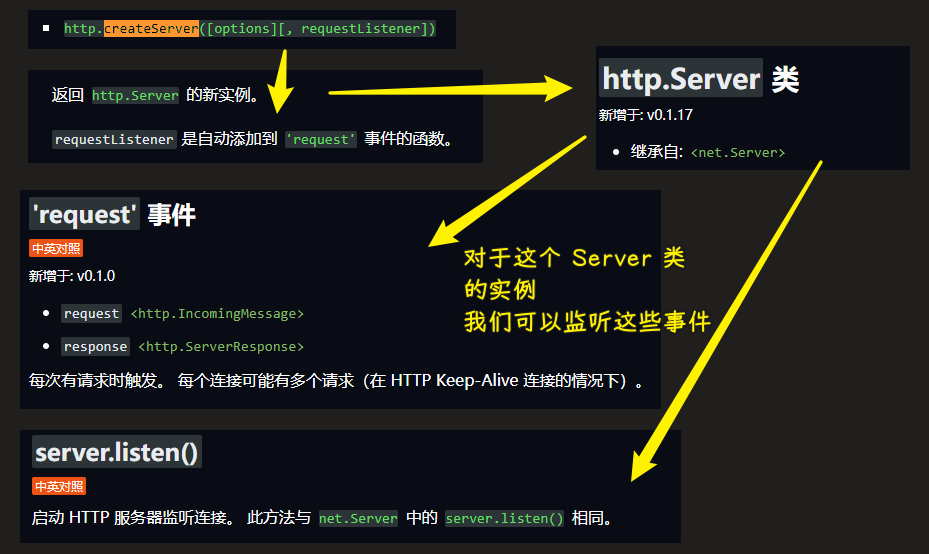

如何看文档？ -> 找对我们这个代码有用的 API：

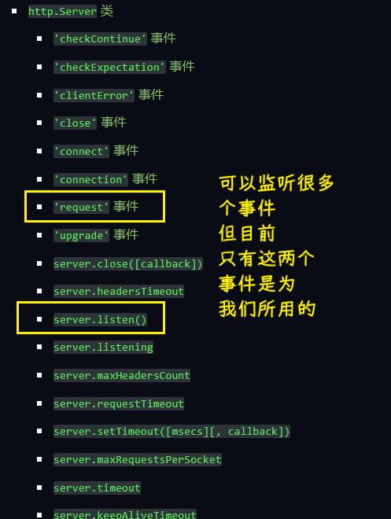

所以说，node 的 ts 声明写得不好，那么你就只能看文档了！

💡：`net.Server`

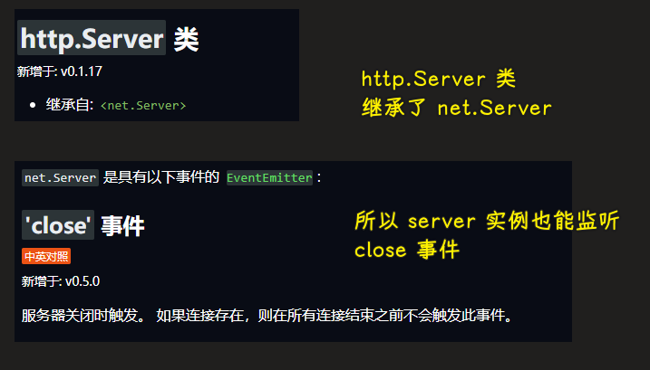

不过这个`close`事件一般不用，我们很少会关闭服务器

常用的是`error`事件，如果服务断了，就会通过这个事件发送个短信给开发者

💡：为啥要给`request`和`response`指定类型？

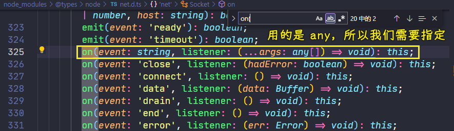

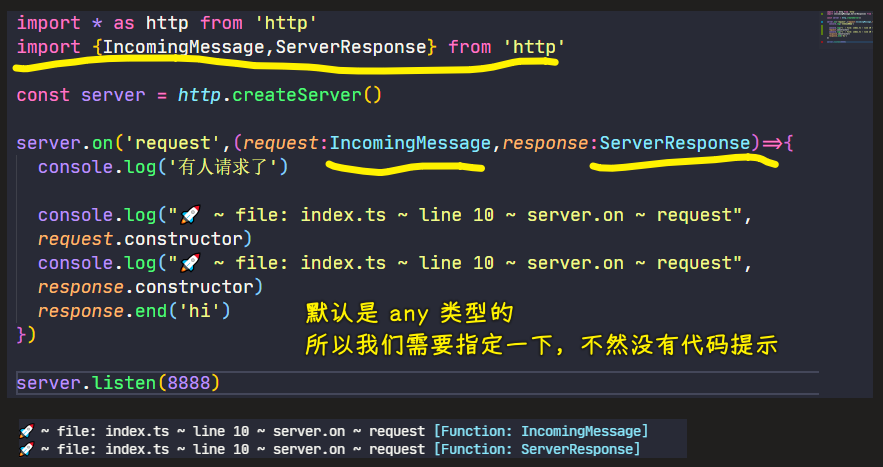

- `class IncomingMessage extends stream.Readable {}`
- `class ServerResponse extends OutgoingMessage {}`，`OutgoingMessage`这个类继承自`Stream`

指定类型后，我们就不用看文档，直接看提示写了！

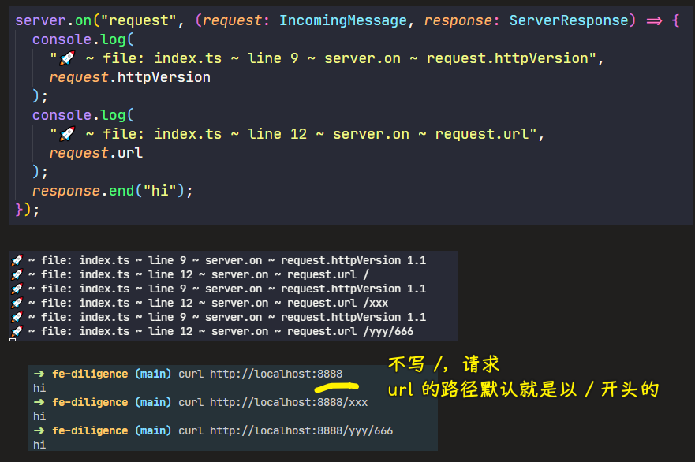

2、用 Node.js 获取请求内容

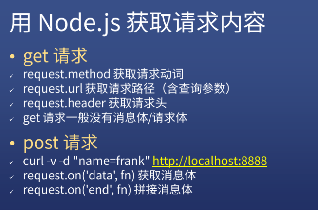

💡：测试 Get 请求

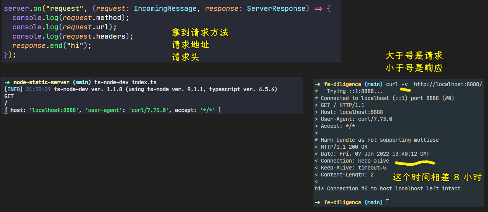

💡：测试 Post 请求

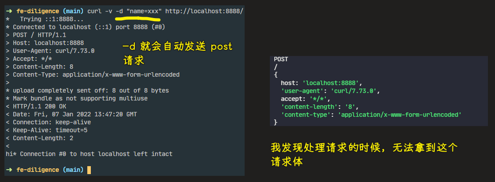

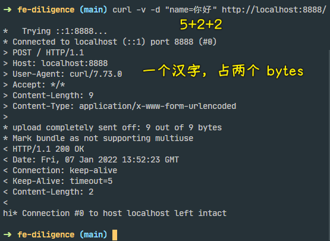

4）如何得到请求消息体

如何 post 请求的请求体或者说是消息体

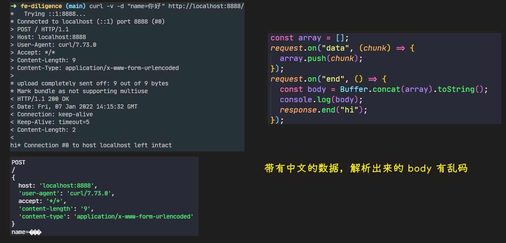

这种上传方式，即便你上传 1 G 的内容，我都可以拿到，当然，前提是服务器内存是够的，只有内存够，我就可以一点一点的把数据给拿完……

处理乱码：

``` js
import * as http from "http";
import { IncomingMessage, ServerResponse } from "http";
const iconv = require("iconv-lite");
const server = http.createServer();

server.on("request", (request: IncomingMessage, response: ServerResponse) => {
  console.log(request.method);
  console.log(request.url);
  console.log(request.headers);
  const array = [];
  request.on("data", (chunk) => {
    array.push(chunk);
  });
  request.on("end", () => {
    console.log(array);
    console.log(Buffer.concat(array));
    const body = iconv.decode(Buffer.concat(array), "GBK");
    console.log(body);
    response.end("hi");
  });
});

server.listen(8888);
```

> 最好给`concat`指定每个 buffer 实例加起来的总长度，每个 chunk 都是一个 buffer 实例，当你在`concat`这些 buffer 实例的时候，`concat`内部就不会重新计算每个 `buffer` 实例加起来的总长度了

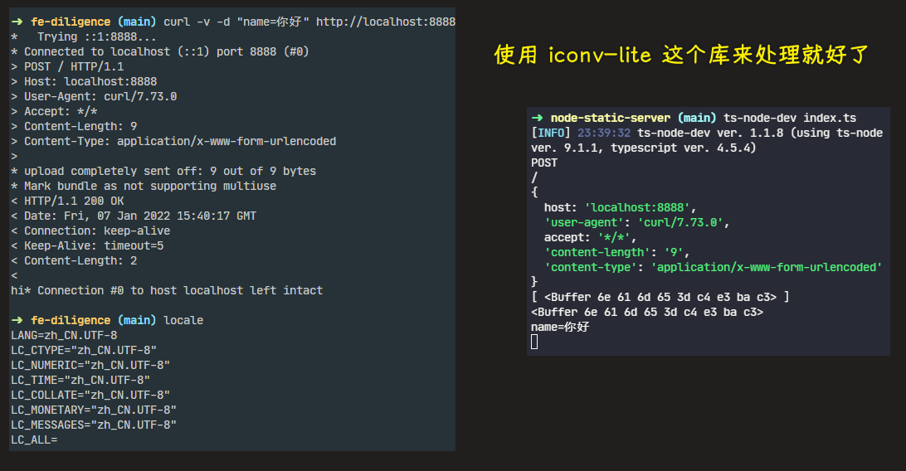

> 即便 locale 都是 UTF-8，但这上传的数据还是 GBK！

- [Node—— GBK 编码格式的 Buffer 转字符串中文](https://blog.csdn.net/qq812457115/article/details/104691864)
- [nodejs 中 如何将一个 utf8 字符串转为 gbk 字符串？ - 知乎](https://www.zhihu.com/question/26121387)
- [curl 后中文乱码？ - SegmentFault 思否](https://segmentfault.com/q/1010000010619086)
- [3. Buffer 的转换，终端的乱码的形成。 - 简书](https://www.jianshu.com/p/1a4583ec4d3c)
- [【深入探究 Node】（5）“Buffer 与乱码的故事” 有十问-技术圈](https://jishuin.proginn.com/p/763bfbd5f744)
- [Buffer 与中文乱码问题 - 刘雷的博客 - Ray's Blog ](https://isliulei.com/article/node-Buffer/)

💡：为什么`request`对象可以监听到`data`事件？

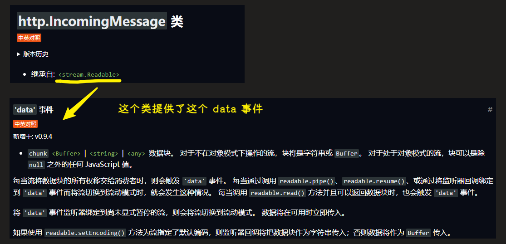

`data`事件是不停触发的，根据协议，每次上传的数据是有限制的，不可能一次上传完所有数据……

`chunk` -> 一小块代码，或一小块数据 -> 每一个`chunk`都是一个 `Buffer`，通过它提供的`concat`方法可以把这些小块数据连接成一大串数据 -> 说白了，就是还原完整数据！

还需要监听上传已结束的事件 -> `end`

对了，要对这个请求处理完后，再去响应，也就是把`response.end("hi")`写在`request.on`的回调里边

💡：请求体里边可以容纳多少数据？

> post 理论上讲是没有大小限制的，HTTP 协议规范也没有进行大小限制，但实际上 post 所能传递的数据量大小取决于服务器的设置和内存大小

5）response 对象

