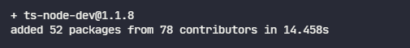
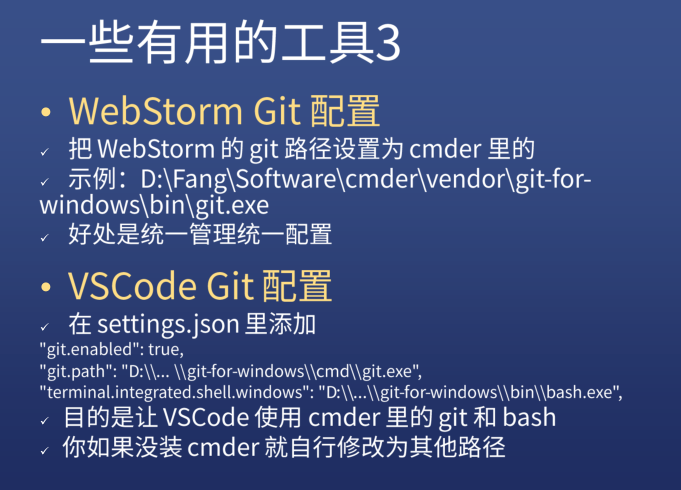
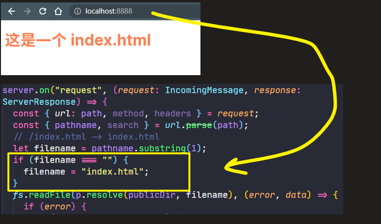
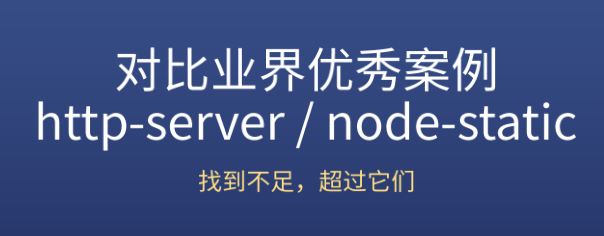

### ✍️ Tangxt ⏳ 2022-01-07 🏷️ Node.js

# 05-静态服务器

这节讲 HTTP 模块，该模块很重要，有了这个模块，你就可以做服务器开发了 -> 该模块需要借助 C/C++ 写的库才得以实现 -> 该 http 模块最终暴露很好用的 API 以供我们使用

理论上应该先学习 HTTP 协议再学习 HTTP 模块 -> 跳过 HTTP 协议的学习，选择在实践中学习这个 HTTP 模块

总之，在不了解 HTTP 协议和 TS 情况下，去实践，实践完后，再去看文档

1）配置 Webstorm 和 VS Code

💡：一些有用的工具


- node-dev -> 不适合在公司使用，因为每次部署重新重启即可，而不是改一下代码就重启一下
- ts-node -> 不需要我们安装 babel 就能支持 ts 在 node 中使用
- ts-node-dev -> 二者的结合体

``` bash
yarn global add ts-node-dev
# or
npm i -g ts-node-dev
```



使用它的时候还得安装`TypeScript`：

``` bash
npm i typescript -g
```


💡：一些有用的工具 2


💡：一些有用的工具 3




2）创建项目

> 在 VS Code 里边写 TS 项目：[TypeScript Programming with Visual Studio Code](https://code.visualstudio.com/docs/languages/typescript)


💡：安装`@types/node`，让开发工具知道 node 里边有哪些模块 -> 为了代码的智能提示


💡：为什么要添加`response.end`？

不添加：


添加后：


> [Demo](https://github.com/ppambler/fe-diligence-demo/commit/5bd92c6)

3）request 对象

对刚才写的代码进行一个详细和完整的研究

1、Server 是个什么东西？


💡：为啥推荐看官方文档？


一些开发者为 node 创建的 ts 声明，完全看不懂啊！跟 node 结合的不咋地！


如何看文档？ -> 找对我们这个代码有用的 API：


所以说，node 的 ts 声明写得不好，那么你就只能看文档了！

💡：`net.Server`


不过这个`close`事件一般不用，我们很少会关闭服务器

常用的是`error`事件，如果服务断了，就会通过这个事件发送个短信给开发者

💡：为啥要给`request`和`response`指定类型？


- `class IncomingMessage extends stream.Readable {}`
- `class ServerResponse extends OutgoingMessage {}`，`OutgoingMessage`这个类继承自`Stream`

指定类型后，我们就不用看文档，直接看提示写了！


2、用 Node.js 获取请求内容


💡：测试 Get 请求


💡：测试 Post 请求


4）如何得到请求消息体

如何 post 请求的请求体或者说是消息体


这种上传方式，即便你上传 1 G 的内容，我都可以拿到，当然，前提是服务器内存是够的，只有内存够，我就可以一点一点的把数据给拿完……

处理乱码：

``` js
import * as http from "http";
import { IncomingMessage, ServerResponse } from "http";
const iconv = require("iconv-lite");
const server = http.createServer();

server.on("request", (request: IncomingMessage, response: ServerResponse) => {
  console.log(request.method);
  console.log(request.url);
  console.log(request.headers);
  const array = [];
  request.on("data", (chunk) => {
    array.push(chunk);
  });
  request.on("end", () => {
    console.log(array);
    console.log(Buffer.concat(array));
    const body = iconv.decode(Buffer.concat(array), "GBK");
    console.log(body);
    response.end("hi");
  });
});

server.listen(8888);
```

> 最好给`concat`指定每个 buffer 实例加起来的总长度，每个 chunk 都是一个 buffer 实例，当你在`concat`这些 buffer 实例的时候，`concat`内部就不会重新计算每个 `buffer` 实例加起来的总长度了


> 即便 locale 都是 UTF-8，但这上传的数据还是 GBK！

- [Node—— GBK 编码格式的 Buffer 转字符串中文](https://blog.csdn.net/qq812457115/article/details/104691864)
- [nodejs 中 如何将一个 utf8 字符串转为 gbk 字符串？ - 知乎](https://www.zhihu.com/question/26121387)
- [curl 后中文乱码？ - SegmentFault 思否](https://segmentfault.com/q/1010000010619086)
- [3. Buffer 的转换，终端的乱码的形成。 - 简书](https://www.jianshu.com/p/1a4583ec4d3c)
- [【深入探究 Node】（5）“Buffer 与乱码的故事” 有十问-技术圈](https://jishuin.proginn.com/p/763bfbd5f744)
- [Buffer 与中文乱码问题 - 刘雷的博客 - Ray's Blog ](https://isliulei.com/article/node-Buffer/)

💡：为什么`request`对象可以监听到`data`事件？


`data`事件是不停触发的，根据协议，每次上传的数据是有限制的，不可能一次上传完所有数据……

`chunk` -> 一小块代码，或一小块数据 -> 每一个`chunk`都是一个 `Buffer`，通过它提供的`concat`方法可以把这些小块数据连接成一大串数据 -> 说白了，就是还原完整数据！

还需要监听上传已结束的事件 -> `end`

对了，要对这个请求处理完后，再去响应，也就是把`response.end("hi")`写在`request.on`的回调里边

💡：请求体里边可以容纳多少数据？

> post 理论上讲是没有大小限制的，HTTP 协议规范也没有进行大小限制，但实际上 post 所能传递的数据量大小取决于服务器的设置和内存大小

5）response 对象


> TCP 这个 -> 涉及到分段上传 -> 上传的数据 99% 是 Buffer

💡：如果响应的状态码是 `404`？


💡：设置响应头和响应体

> 那个`Date`响应头不要改，不然很有可能会出现问题

- `write`可以调用多次，每次返回部分内容

整个响应都是 Node.js 控制的，它能控制响应的每一个部分：


6）完成目标 1：根据 url 返回不同的文件

一个网页有 html、css、js 等不同的文件

静态文件一般放在`static`或者`public`目录里边 -> 这个目录里边的代码是运行在浏览器上的，可不是 Node 这个环境里边

💡：添加响应头`Content-type`？


当然，你不加也可以：


不过，建议最好加上！不然，很有可能会出现某种问题

当你请求`http://localhost:8888/index.html`，在解析`index.html`这个文件内容的时候也会发送请求：

- `http://localhost:8888/style.css`
- `http://localhost:8888/main.js`


> [Demo](https://github.com/ppambler/fe-diligence-demo/commit/67939ad)

7）完成目标 2：处理查询参数

> 提示：使用 `url.parse`

为什么要处理查询参数？


简单处理查询参数：


不认识的路径都走`404`，该服务器只认识：`/index.html`、`/style.css`、`/main.js`这三个路径

💡：改名字


💡：`url.path`解析路径会得到啥？

请求：`http://localhost:8888/index.html?q=1`

``` js
import * as url from "url";
const object = url.parse(path);
```


💡：不管你传入什么查询字符串，Server 都忽视掉


使用`url.parse`得到新的路径，让这个路径作为`switch`的参数

8）完成目标 3：匹配任意文件

问题：增加文件，难道又得去写一个`case`吗？


我们希望文件追加了，也不用去改 Server 的代码，而是会自动匹配这个文件路径

观察代码得知：


代码：


💡：`response.end`不等于这个函数以返回，只是响应结束罢了


💡：为什么一定要加`content-type`？


➹：[MIME 类型 - HTTP - MDN](https://developer.mozilla.org/zh-CN/docs/Web/HTTP/Basics_of_HTTP/MIME_types)

9）完成目标 4：处理不存在的文件

> 提示：返回一个 404 页面


> 对于静态服务器 -> 所谓的 url 路径，实质上就是对应着本地磁盘里的某个文件，当然，我们是可以修改成不对应的，但毕竟这是静态服务器，所以这没必要哈！

> [Demo](https://github.com/ppambler/fe-diligence-demo/commit/c81b19b)

错误？ -> 分很多种

如果你遇到`500`错误 -> 一般把这样的错误归为服务器繁忙，毕竟这种错误无法测试得知

💡：`readFile`出错时，其`error`的返回值？


💡：返回图片？


浏览器会自动解析二进制数据

💡：`filename`有可能是空的？


为什么前端喜欢把第一个页面叫做`index.html`？

这是不成文的规定，如果发现用户没有填路径，那么默认就打开`index.html`



💡：在浏览访问目录？


💡：为什么`html`文件里边的图片路径不要写相对路径？

写相对路径：


写绝对路径：


把当前这个`public`设置为根目录 -> 这是 wb 需要配置的，VS Code 不需要


10）完成目标 5：处理非 GET 请求

> 提示：`405 Method Not Allowed` -> 禁用请求中指定的方法

用户有时候发起的不是 `GET` 请求，比如：


告诉用户不是文件不存在，而是不能用`POST`请求，毕竟我们这是一个静态服务器啊

💡：遇到 `POST` 请求？响应 `405`？


💡：遇到`POST`请求？给个假响应？


💡：难道只处理`POST`吗？其它的请求动作呢？


11）完成目标 6：添加缓存选项

> 提示：[Cache-Control](https://developer.mozilla.org/zh-CN/docs/Web/HTTP/Headers/Cache-Control#%E7%BC%93%E5%AD%98%E9%9D%99%E6%80%81%E8%B5%84%E6%BA%90)

💡：什么是缓存？

没有缓存的情况：


我们希望第二次请求的内容跟上次是一样的，那就不要再发送请求了


对于缓存，浏览器会到内存或硬盘里边去读

注意：只有首页是不能缓存的，浏览器不接受首页缓存，而其它文件是可以缓存的

💡：不要写死缓存时间


在测试这个代码前，先勾选一下`Disable cache`来完成第一次不要缓存的请求，之后第二次请求前，就去掉勾选


💡：我们希望在启动这个服务器应用的时候，添加缓存选项

目前我们启动应用是这样的：

``` bash
ts-node-dev index.ts
```

我们希望：

``` bash
ts-node-dev index.ts -c 100
```

就是在缓存`100 s`

所以我们需要获取启动应用时用户所传的参数，也就是`-c 100`

参考上一节的`node-todo`应用 -> 创建一个`cli.ts`去读取参数 -> 再读取的参数传给那个缓存变量

这样一来，在这个缓存时间内，对于被已经缓存的文件，你再次重新发起请求，是不会去访问服务器的，而是直接从缓存里边拿数据！

💡：使用缓存的网站？


💡：所有资源都缓存

如何让缓存失效？ -> 请求的文件是有后缀的


如果文件的路径不会因为内容变化而更新，那就不要做缓存了

一般做缓存是在 Nginx 里边配置的

当然，也可以用 Node.js 来做，比如`js`文件，缓存 10 天，图片文件，缓存 10 年等等


12）完成目标 7：响应内容启用 gzip

> 可选目标 -> 提示：[zlib 文档](http://nodejs.cn/api/zlib.html)

这个操作不是前端做的！

13）对比业界优秀案例



- [http-server  -  npm](https://www.npmjs.com/package/http-server)
- [node-static  -  npm](https://www.npmjs.com/package/node-static)

查看它们的 Github HomePage

💡：`http-server`

- ` http-server [path] [options]` -> `path`相当于是我们指定的`public`目录


看别人是怎么写的，那你就可以根据它的描述，来完善自己的静态服务器

💡：`node-static`

可以面向程序员，然后基于它写自己的静态服务器，也可以使用命令行来使用基本的静态服务器功能

---

结合它们俩，你就可以做一个非常好用的静态服务器了！

💡：为啥要做静态服务器？


发布到 npm，三个月内不停的加功能，你就能得到一个正版的 Webstorm 了

访问这个地址：[Licenses for Open Source Development - Community Support](https://www.jetbrains.com/community/opensource/#support)

如果你是开源社区的贡献者，那么就可以使用 JB 这个公司推出的所有 IDE

Who can get free licenses？


- 你的这个静态服务器项目
- 添加 MIT 协议
- 不盈利
- 每个月至少有一次提交
- 每次完成一个功能或者修复某个 bug，就更新一次版本呗！

条件满足后，访问这个地址：[Request for Open Source Development License](https://www.jetbrains.com/shop/eform/opensource?product=ALL)

开始你的申请

注意：


输入项目描述 -> 谷歌翻译 -> 把中文翻译成英文，然后复制进去即可！

申请后，一周内会有恢复 -> 发邮件给你

14）总结

