### ✍️ Tangxt ⏳ 2022-01-09 🏷️ Node.js

# 06-命令行翻译工具

结合命令行工具和 http 模块的 request 模块来做一个翻译工具

在终端输入：`fy world` -> 就会输出：`世界`

### <mark>1）使用百度翻译 API</mark>

> `alt + 1`、`alt + 2` -> 切换到文件目录、切换到终端

1. 创建`fanyi`目录
2. `cd fanyi`
3. `yarn init -y`
   1. 修改版本号为`0.0.1`
4. 创建`src`目录 -> 用来放置源代码
   1. `main.ts`
5. 添加`scripts` -> `'start'： 'ts-node-dev src/main.ts'`
6. 安装`commander` -> 手否要手动安装`types`声明？
   1. 不需要，它有个`typings`目录，这里边有一个`index.d.ts`，也就是说它自带了`types`声明 -> 因此我们不需要安装这个额外工具了
7. 创建`src/cli.ts` -> 专门用来处理命令行
8. 由于在做`node`开发 -> 安装`@types/node`才会有代码提示 -> 这是开发依赖
9. 在`cli.ts`里边使用`commander`

> [Demo](https://github.com/ppambler/fe-diligence-demo/commit/3dd1627)

💡：更改`Usage`的输出情况？

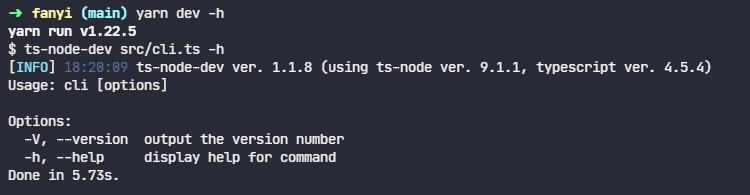

``` js
// import * as commander from "commander";
// const program = new commander.Command();
import { Command } from "commander";
const program = new Command();
program.version("0.0.1").name("fy").usage("<english>");

// 解析参数，比如自带的 -h，和我们通过 program.version 写的 -V
// 根据解析结果，会在终端打印相应的内容
program.parse(process.argv);

```

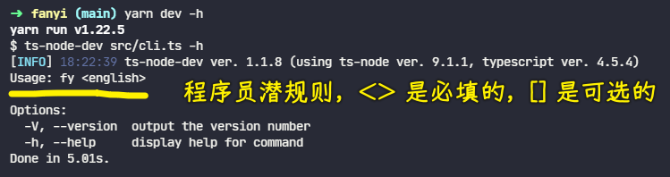

👇：添加功能 -> 获取输入的单词，然后到网上查询这个单词的翻译，再显示到终端

💡：获取用户输入的单词

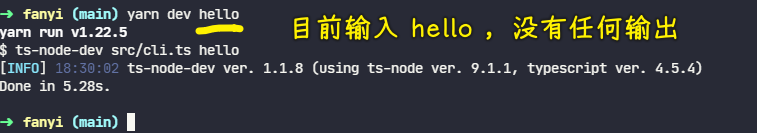

---

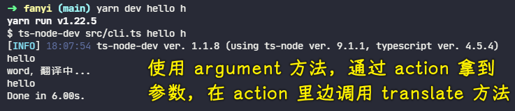

> [Demo](https://github.com/ppambler/fe-diligence-demo/commit/c426bc6)

💡：如何把获取到的单词转化成中文？

- 推荐百度和有道翻译接口
- 谷歌的翻译接口被墙了

申请好后，不要暴露你的 APP ID 和密钥：


文档：[百度翻译开放平台](https://fanyi-api.baidu.com/doc/21)

用`HTTPS`的

一个请求示例：

<https://api.fanyi.baidu.com/api/trans/vip/translate?q=apple&from=en&to=zh&appid=2015063000000001&salt=1435660288&sign=f89f9594663708c1605f3d736d01d2d4>

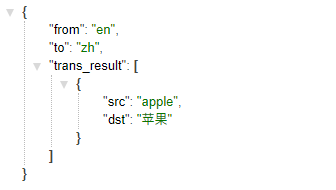

我们要关注的输入：

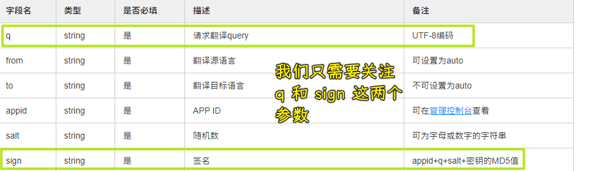

注意，如果你的请求链接被泄漏了，这也不打紧，因为这个链接只能固定请求这个单词

比如这样：

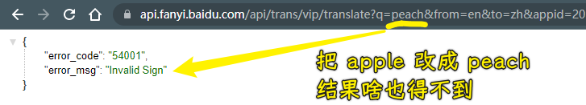

💡：不可知验证

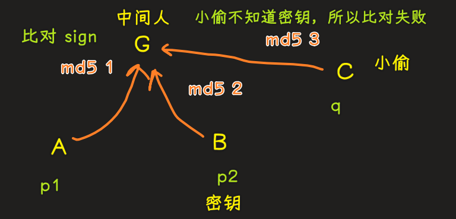

➹：[开放 api 接口签名验证，保证通讯的安全性 - 知乎](https://zhuanlan.zhihu.com/p/448418213)

---

知道请求地址是什么，以及需要什么参数后，我们就得用 Node.js 去发请求了，之前我们接触的 Node.js 响应，现在则是请求

### <mark>2）使用 Node.js 调用百度 API</mark>

文档：[https 安全超文本传输协议 - Node.js API 文档](http://nodejs.cn/api/https.html#httpsrequesturl-options-callback)

💡：拿到百度首页的数据

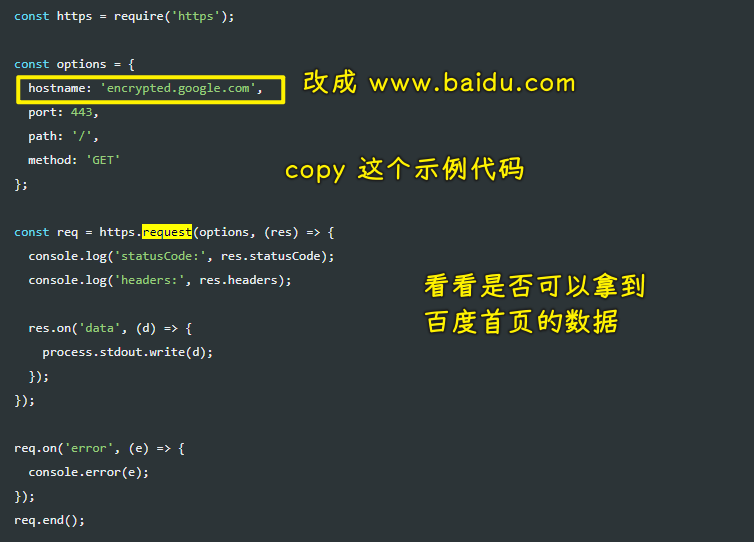

💡：测试百度翻译默认给出的那个接口

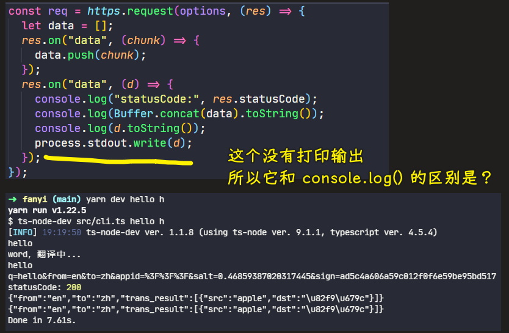

➹：[nodejs 中的 process.stdout.write](https://blog.csdn.net/weixin_43487782/article/details/117488160)

➹：[javascript - Difference between "process.stdout.write" and "console.log" in node.js? - Stack Overflow](https://stackoverflow.com/questions/4976466/difference-between-process-stdout-write-and-console-log-in-node-js)

💡：改成自己想要的请求地址，也就是翻译 API 接口

文档：[querystring 查询字符串 - Node.js API 文档](http://nodejs.cn/api/querystring.html#querystringstringifyobj-sep-eq-options)

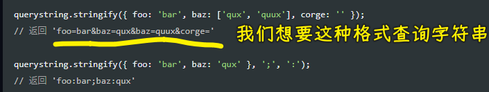

测试`querystring`：

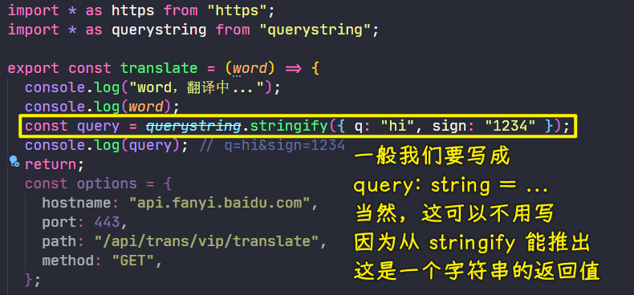

> 不需要我们需要 `https` 这样的协议

💡：Node.js 没有自带的`md5`，我们需要自己安装

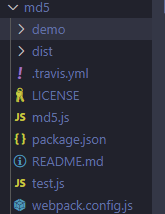

它不支持 TS，也就是没有那个`@types`

我们经常会看到有些库说到「该库完美兼容 TS」，我们知道 TS 本来就兼容 JS 的，可加「完美」二字是为啥呢？

比如`md5`就没有完美兼容，你看看`commander`，它就是完美兼容的，你写啥 API 都会用代码提示

当然，前端社区也提供了有关`md5`的`types`声明

``` bash
yarn add @types/md5 -D
```

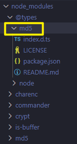

使用`md5`：

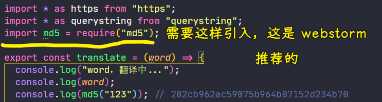

> 得到是一个 32 位的字符串

💡：密钥和 ID 不能被泄漏

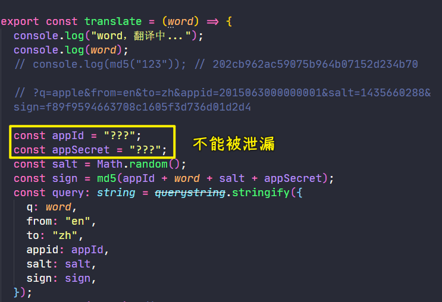

### <mark>4）处理 Secret & 使用 TypeScript 声明 BaiduResult</mark>

为了不泄漏密钥和 ID，我们创建了一个`private.ts`文件 -> 在这个文件里边写这两个数据

💡：用自己的密钥和 APP ID 去测试其它单字的翻译

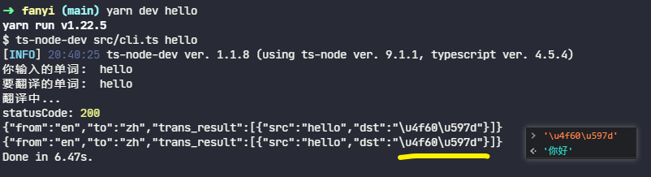

💡：如何获取`response`的消息体？


💡：如何知道对象有什么？

根据响应结果来写`type`

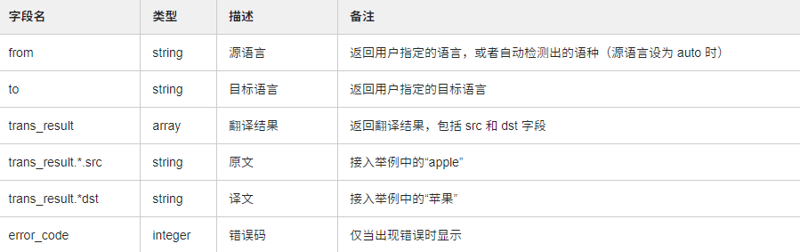

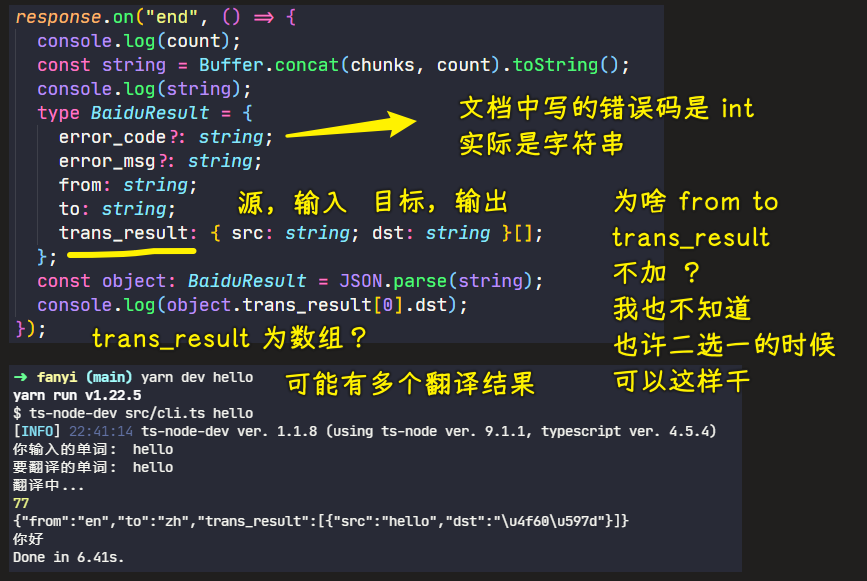

💡：`trans_result` -> 这个`trans`不要缩写

因为`trans`有女装大佬之意，也就是「跨性别」

不知道这个英文的简写是何意就不要用缩写，比如你写 TypeScript 的缩写`ts`，也有女装大佬的意思

💡：错误码处理

为什么需要处理？


错误码中文化处理（本来返回英文的）：

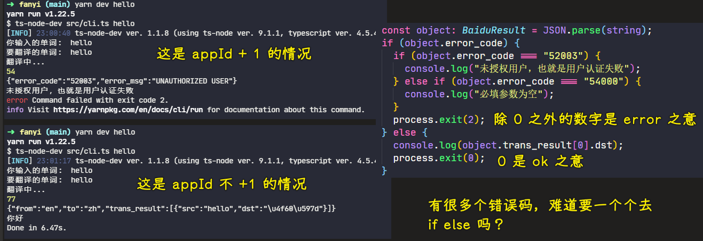

### <mark>5）表驱动编程消除多余的 if</mark>

当你的项目代码越来越多，你会看到这样的弱智代码：

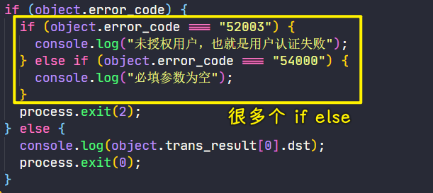

如何消除这样的弱智代码？

> 只要`if else` 超过 5 个，那么你的代码就一定有问题

> [Demo](https://github.com/ppambler/fe-diligence-demo/commit/af093d6)

类似一机一码这样

还有更复杂的情况，比如`{}`里边有多个变量赋值的情况，也可以用表驱动编程

### <mark>6）英译中 & 中译英</mark>

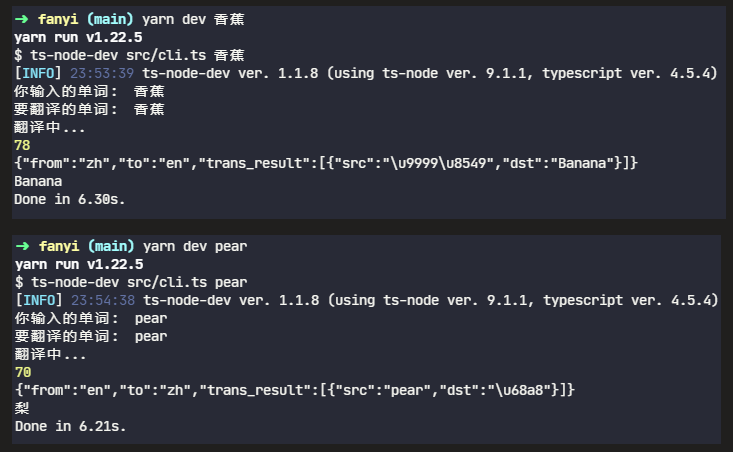

> [Demo](https://github.com/ppambler/fe-diligence-demo/commit/18b04f4)

💡：`cli.ts` 这是 ts 文件，我们需要把它编译成 js 文件，才能交给 node 去执行

### <mark>7）如何发布 TypeScript 包到 npm</mark>

全局安装`typescript`

查看`tsc`版本

``` bash
tsc -V
# Version 4.5.4
```

创建`tsconfig`文件

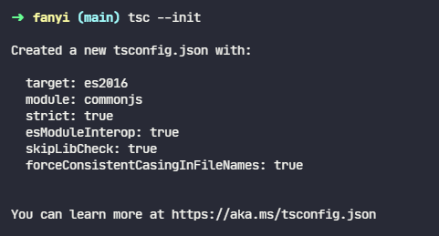

有了这个文件之后，你会发现原先的`main.ts`文件爆红了

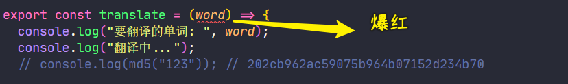

确定这个值的类型 -> 用`constructor`就好了

---

`tsconfig.json`这个文件很大，我们要改的地方不多

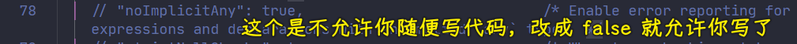

就改这个：`"outDir": "dist/"`

💡：`@types/node`和`node`不是完全兼容的

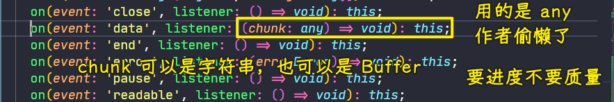

消除 ts 报错：

> [Demo](https://github.com/ppambler/fe-diligence-demo/commit/1f636eb)

💡：编译文件

直接在项目根目录敲`tsc`即可：

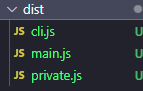

该`dist`目录不能上传，因为有密钥

💡：发布前的配置

> [Demo](https://github.com/ppambler/fe-diligence-demo/commit/739e6cf)

💡：本地测试情况

``` bash
yarn link
```


也可以配置别名（注意路径）：

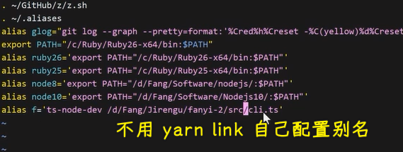

💡：对比其它的，比如`fanyi`

``` bash
npm install fanyi -g
```

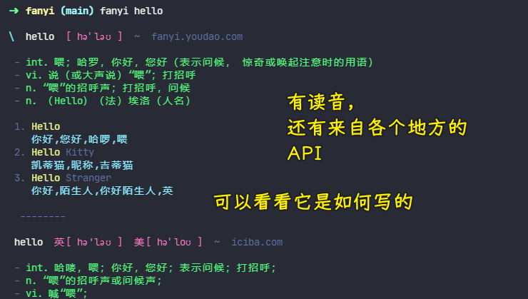

➹：[afc163/fanyi: A 🇨🇳 and 🇺🇸 translate tool in your command line.](https://github.com/afc163/fanyi)

➹：[基于百度翻译 API 的 node 插件 - 掘金](https://juejin.cn/post/6906787897811501063)

---

注意：不要说`md5`加密，一旦你这么说了，那么你就是外行了！

### <mark>8）总结和问答</mark>

> 如果想把这个项目作为面试项目，那么你可以把密钥发布，面试完，再把你账号的你密钥给重置了

用到了三个模块：

``` js
import * as https from "https";
import * as querystring from "querystring";
import md5 = require("md5");
```

- `querystring.stringify()`：构建查询字符串
- `https.request`：发请求
- TS 声明 -> 关于对象的声明
- 功能：用到了百度收费的 API -> 可以中译英，也可以英译中

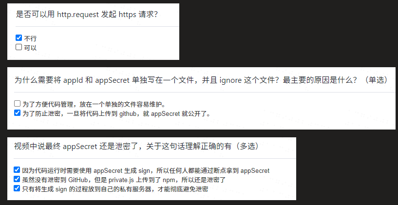

💡：前朝的剑斩本朝的官？

俗语。指用前朝代的法律，去处理现在这个朝代的官员。现代延伸指不同时代的法律有所差异，无法直接适用

💡：`import` 和 `require` 混合用

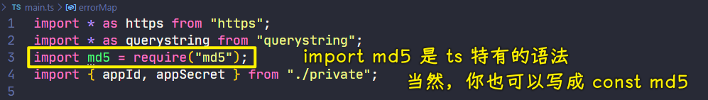

首选 ES Modules，次选 CommonJS 

💡：tsc 默认的编译结果都是 CommonJS 规范的

> 你可以到`tsconfig.json`里边配置`module`选项

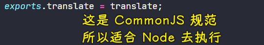

使用了 TS 去开发 Node 应用后，你可以直接用 `import` 和 `export` 去导入导出模块，毕竟你可以直接用`ts-node-dev`去运行你的 TS 代码

Node 对 ES Modules 的支持 -> `>=9`的 Node 才支持

搜索「node esmodules 开启」：

- [2020 年我们可以在 Node 中使用 ES Modules 了吗 - 知乎](https://zhuanlan.zhihu.com/p/337796076)
- [Node 9 下 import/export 的丝般顺滑使用 - CNode 技术社区](https://cnodejs.org/topic/5a0f2da5f9de6bb0542f090b)